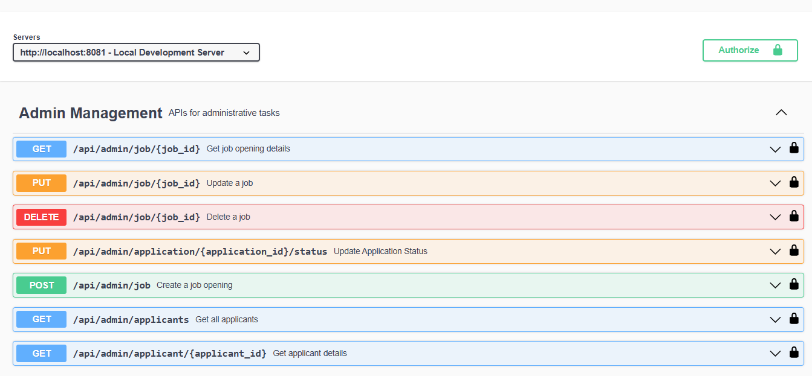
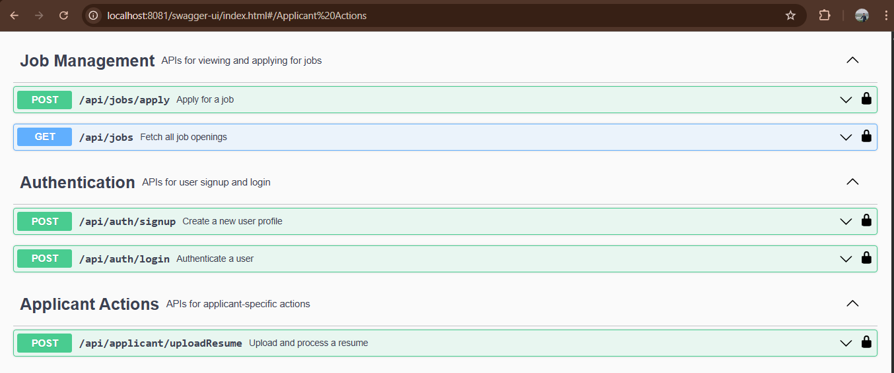
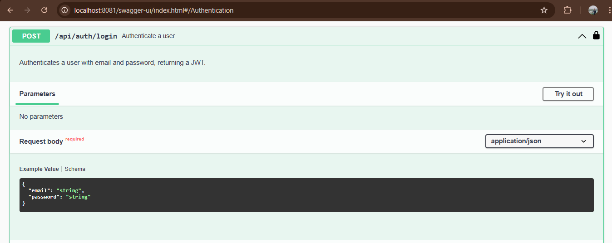
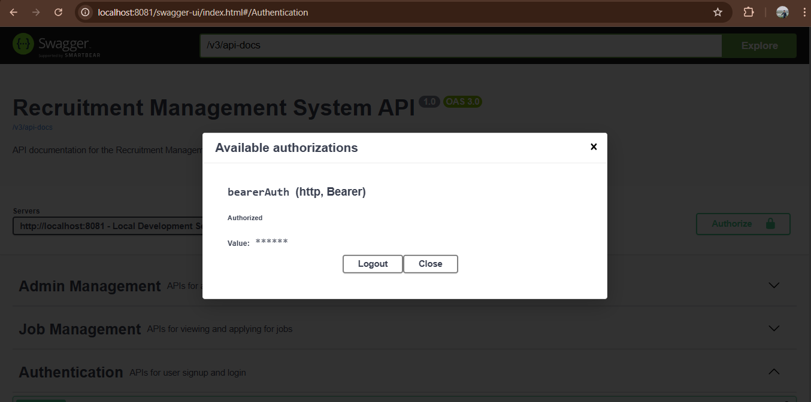

# Recruitment Management System – Backend (Spring Boot)

A **production-ready backend server** for managing the entire recruitment lifecycle — from job posting to candidate hiring.  
Includes secure authentication, resume parsing, workflow automation, and modular architecture.

<p align="center">
  
  
  
  
  
</p>

---

## 🚀 Features

- **User Management** – Admin & Applicant roles with RBAC  
- **JWT Authentication** – Secure, stateless token-based sessions  
- **Job Management** – Create, update, delete, and view job openings  
- **Recruitment Workflow:**  
  `APPLIED → SHORTLISTED → INTERVIEW → HIRED`  
- **Applicant Dashboard** – Application history & status updates  
- **Resume Parsing** – Extract skills, education & experience from PDF/DOCX  
- **MySQL Persistence** – Reliable and scalable relational storage  
- **Environment-based Secrets** – Configurable DB & API keys  
- **Swagger Documentation** – Complete interactive API explorer  

---

## 📂 Project Structure

```
src/main/java/com/example/recruitment
│
├── config         → Security, CORS, Beans
├── controller     → REST controllers
├── dto            → Request/Response DTOs
├── model          → Entities (JPA)
├── repository     → Data access layer
├── service        → Business logic
├── security       → JWT filters, utils, UserDetails
└── exception      → Global exception handling
```

---

## 🛠️ Setup & Installation

### 1️⃣ Prerequisites
- JDK 17+
- Maven 3.6+
- MySQL Server installed

---

### 2️⃣ Database Setup

```sql
CREATE DATABASE recruitmentdb;
```

---

### 3️⃣ Environment Variables

| Variable        | Description          | Example |
|----------------|----------------------|---------|
| `DB_URL`       | JDBC URL             | `jdbc:mysql://localhost:3306/recruitmentdb` |
| `DB_USERNAME`  | MySQL Username       | `root` |
| `DB_PASSWORD`  | MySQL Password       | `your_password` |
| `JWT_SECRET`   | JWT Secret Key       | `YourLongSecretKey` |
| `RESUME_API_KEY` | Resume Parser Key  | `YourApiKey` |

> 💡 **Tip:** In IntelliJ → Run Configurations → Add Environment Variables.

---

## 🧪 Build & Run

### Clone repository

```bash
git clone https://github.com/pawang001/Recruitment-Management-System.git
cd Recruitment-Management-System
```

### Build

```bash
mvn clean install
```

### Start Server

```bash
mvn spring-boot:run
```

Server runs at: **http://localhost:8081**

---

## 📘 Swagger UI

Access API docs at:

👉 **http://localhost:8081/swagger-ui.html**

### Steps:
1. Run the server  
2. Login to obtain JWT token  
3. Click **Authorize**  
4. Enter:  
   ```
   Bearer <token>
   ```
5. Access secured endpoints  

---

### Main View

The main view lists all available controllers and their endpoints.







### Authentication Flow

To access secured endpoints, you must first authenticate.


1.  Use the `POST /api/auth/login` endpoint with a valid user's credentials to get a JWT.

2.  Click the **Authorize** button at the top of the page.

3.  In the pop-up, paste the token in the format `Bearer <your_token>`.







---

## 🔗 API Endpoints Overview

---

### 🔐 Authentication

| Method | Path | Description | Role |
|--------|------|-------------|------|
| POST | `/api/auth/signup` | Register Admin/Applicant | Public |
| POST | `/api/auth/login` | Login & receive JWT | Public |

---

### 🛠️ Admin Endpoints

| Method | Path | Description | Role |
|--------|------|-------------|------|
| POST | `/api/admin/job` | Create job | ADMIN |
| PUT | `/api/admin/job/{id}` | Update job | ADMIN |
| DELETE | `/api/admin/job/{id}` | Delete job | ADMIN |
| GET | `/api/admin/applicants` | List all applicants | ADMIN |
| GET | `/api/admin/applicant/{id}` | View applicant details | ADMIN |
| PUT | `/api/admin/application/{id}/status` | Change application status | ADMIN |

---

### 👨‍💼 Applicant Endpoints

| Method | Path | Description | Role |
|--------|------|-------------|------|
| POST | `/api/applicant/uploadResume` | Upload & parse resume | APPLICANT |
| GET | `/api/applicant/my-applications` | View application history | APPLICANT |

---

### 📄 Job Endpoints

| Method | Path | Description | Role |
|--------|------|-------------|------|
| GET | `/api/jobs` | List all jobs | Authenticated |
| POST | `/api/jobs/apply` | Apply for job | APPLICANT |

---

## 🐞 Troubleshooting

### ❌ Cannot connect to MySQL
- Ensure MySQL service is running  
- Verify credentials in environment variables  
- Check if port `3306` is available  

### ❌ Resume Parsing not working
- Verify `RESUME_API_KEY`  
- Check external API usage limits  

### ❌ Swagger returns 403
- Login & obtain JWT token  
- Click **Authorize** → Enter `Bearer <token>`  
